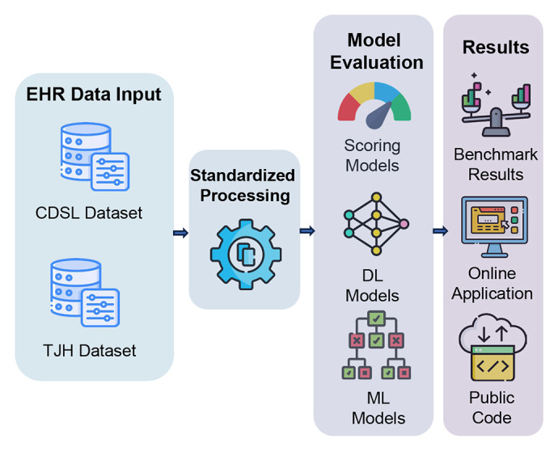

# PyEHR: Predictive Modeling Toolkit for Electronic Health Records

PyEHR is the official implementation of our *Patterns* paper, ["A comprehensive benchmark for COVID-19 predictive modeling using electronic health records in intensive care"](https://www.cell.com/patterns/fulltext/S2666-3899(24)00050-3). It provides reproducible preprocessing, training, tuning, and evaluation pipelines for COVID-19 ICU predictive modeling with EHR data.

Benchmarking results from two real-world COVID-19 EHR datasets, TJH and CDSL, are available through the online [PyEHR platform](https://pyehr.netlify.app). The platform source code is maintained separately at [pyehr-playground](https://github.com/yhzhu99/pyehr-playground).

<p align="center">
  
</p>

<p align="center"><em>Overview of the PyEHR benchmark workflow from our Patterns paper.</em></p>

## Overview

This repository contains:

- standardized preprocessing scripts for TJH and CDSL EHR datasets;
- clinically motivated prediction tasks for COVID-19 ICU patients;
- traditional machine learning, basic deep learning, and EHR-specific predictive models;
- task-specific losses and evaluation metrics, including time-aware loss, ES, and OSMAE;
- best searched hyperparameters in `configs/`;
- training, testing, and W&B-based hyperparameter tuning scripts.

## Prediction Tasks

- [x] Early mortality outcome prediction
- [x] Length-of-stay prediction
- [x] Multi-task / two-stage prediction for mortality outcome and length of stay

## Model Zoo

### Machine Learning Models

- [x] Random forest (RF)
- [x] Decision tree (DT)
- [x] Gradient Boosting Decision Tree (GBDT)
- [x] XGBoost
- [x] CatBoost

### Deep Learning Models

- [x] Multi-layer perceptron (MLP)
- [x] Recurrent neural network (RNN)
- [x] Long short-term memory network (LSTM)
- [x] Gated recurrent unit (GRU)
- [x] Temporal convolutional network (TCN)
- [x] Transformer

### EHR Predictive Models

- [x] RETAIN
- [x] StageNet
- [x] Dr. Agent
- [x] AdaCare
- [x] ConCare
- [x] GRASP

## Repository Structure

```bash
pyehr/
├── configs/        # experiment configs and searched hyperparameters
├── datasets/       # data loaders and TJH/CDSL preprocessing scripts
├── losses/         # task losses, including multitask and time-aware losses
├── metrics/        # task metrics, including ES and OSMAE
├── models/         # ML, DL, and EHR-specific model implementations
├── pipelines/      # Lightning training pipelines for ML and DL models
├── docs/assets/    # README and documentation assets
├── dl_tune.py      # W&B sweeps for deep learning models
├── ml_tune.py      # W&B sweeps for machine learning models
├── train.py        # train selected benchmark models
├── test.py         # test trained models
├── test_twostage.py
└── pyproject.toml  # uv-managed Python environment
```

## Data Format

Processed folds should be stored under `datasets/<dataset>/processed/fold_<k>/` and contain:

- `x.pkl`: `(N, T, D)` list, where `N` is the number of patients, `T` is the number of time steps, and `D` is the number of features. The first features are demographic variables and the remaining features are lab tests or vital signs.
- `y.pkl`: `(N, T, 2)` list, where each target is `[outcome, length_of_stay]`.
- `los_info.pkl`: length-of-stay statistics, such as mean and standard deviation, used to recover raw LOS values after z-score normalization.

## Setup

This project uses [uv](https://docs.astral.sh/uv/) to manage a reproducible Python 3.12 environment.

```bash
uv sync
```

## Usage

1. Download the TJH dataset from [An interpretable mortality prediction model for COVID-19 patients](https://www.nature.com/articles/s42256-020-0180-7). Apply for access to the [Covid Data Save Lives Dataset](https://www.hmhospitales.com/prensa/notas-de-prensa/comunicado-covid-data-save-lives) if you need CDSL.
2. Run the preprocessing script for the target dataset:

   ```bash
   uv run python datasets/preprocess_tjh.py
   uv run python datasets/preprocess_cdsl.py
   ```

3. Run hyperparameter tuning when needed:

   ```bash
   uv run python dl_tune.py
   uv run python ml_tune.py
   ```

4. Train and test models:

   ```bash
   uv run python train.py
   uv run python test.py
   ```

## License

This project is licensed under the MIT license. See [LICENSE](LICENSE) for details.

## Contributors

- [Yinghao Zhu](https://github.com/yhzhu99)
- [Wenqing Wang](https://github.com/ericaaaaaaaa)
- [Junyi Gao](https://github.com/v1xerunt)
- [Liantao Ma](https://github.com/massltime)

## Citation

If this repository is useful for your work, please cite our *Patterns* paper:

```bibtex
@article{gao2024comprehensive,
  title={A comprehensive benchmark for COVID-19 predictive modeling using electronic health records in intensive care},
  author={Gao, Junyi and Zhu, Yinghao and Wang, Wenqing and Wang, Zixiang and Dong, Guiying and Tang, Wen and Wang, Hao and Wang, Yasha and Harrison, Ewen M and Ma, Liantao},
  journal={Patterns},
  volume={5},
  number={4},
  year={2024},
  publisher={Elsevier}
}
```
